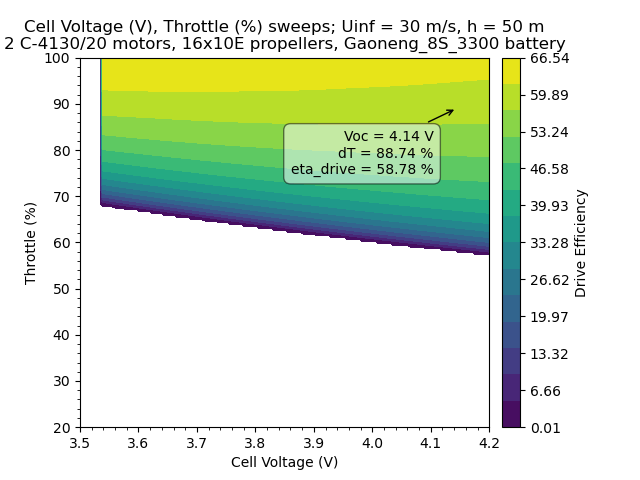

# UAV DEsign eXploration
Sammy N. Nassau, RPI DBF 2021-2026

[UAVDEX Repo](https://github.com/sammy183/UAVDEX)

**TODO: add overview with 3 images of the sorts of plots this code can create**

For detailed background, check out my paper published here:

**ADD LINK**

## IN PROGRESS: April 2026 is the target for public release

## Installation
Anaconda is recommended. In anaconda prompt with the desired env (NOT BASE) activated, simply run:
```python
pip install uavdex
```
## PointDesign
This object allows for calculation of electric aircraft propulsion with *specified components* across the entire flight envelope.

Key inputs:
* **Uinf**:    freestream velocity over the propeller (m/s)
* **h**:       altitude (m)
   * *OR* **rho**: density (kg/m<sup>3</sup>)   
* **dT**:      throttle setting (0-1)
* **SOC**:     battery state of charge (0-1)
  * *OR* **Voc**: cell voltage (~3.3-4.2 for LiPo)
  * *OR* **t**: runtime (s)

Runtime assumes constant current. This is valid when designing an aircraft that spends most of its flight time in a single condition (i.e. cruise).

### Component initialization
```python
import uavdex as ud

design = ud.PointDesign() 			                    # initialize PointDesign object
design.Motor('C-4130/20', nmot = 2)                     # add a motor, and specify the # of motors (nmot = 1 by default)
design.Battery('Gaoneng_8S_3300', discharge = 0.85)     # add a battery, and specify the maximum discharge (default is 0.8, aka 80%)
design.Prop('16x10E')                                   # add a propeller
```
To view the databases (editable CSV sheets) for motor and battery names, call
```python
design.OpenMotorData()
design.OpenBatteryData()
```
and the CSV sheets will be opened by your default system viewer.

All values required are typically provided by the manufacturer, meaning users can add whatever components they desire.

### PointResult
A simple function to get propulsion quantities (called 'propQ' in the code) at a specified flight condition.

*PointResult example*
```python
import uavdex as ud

# Component Initialization
design = ud.PointDesign() 			   # initialize PointDesign object
design.Motor('C-4130/20', nmot = 2)    # add a motor, and specify the # of motors
design.Battery('Gaoneng_8S_3300')      # add a battery 
design.Prop('16x10E')                  # add a propeller

# PointResult
# Uinf:	velocity in m/s
# dT: 	throttle (0-1)
# h: 	altitude in m 
# t: 	runtime in s
propQs = design.PointResult(Uinf = 15, dT = 0.7, h = 50, t = 30, 
                            verbose = True) # this returns propQs as an array and also prints to console. To stop printing, set verbose = False.
```
which prints the following to the console:
> ```
> At Uinf = 15.0 m/s, Throttle = 70%, Density = 1.219 kg/m^3, Runtime = 30.0 s
> Total Thrust (N)                 = 50.254
> Total Torque (Nm)                = 1.776
> RPM                              = 6251.107
> Drive Efficiency                 = 38.44%
> Propeller Efficiency             = 64.82%
> Gearing Efficiency               = 100.00%
> Motor Efficiency                 = 91.52%
> ESC Efficiency                   = 65.10%
> Battery Efficiency               = 99.52%
> Mech. Power Out of 1 Motor (W)   = 581.428
> Elec. Power Into 1 Motor (W)     = 635.293
> Elec. Power Into 1 ESC (W)       = 975.872
> Waste Power in 1 Motor (W)       = 53.865
> Waste Power in 1 ESC (W)         = 340.579
> Waste Power in 1 Battery (W)     = 9.506
> Current in 1 Motor (A)           = 28.674
> Current in 1 ESC (A)             = 30.832
> Current in Battery (A)           = 61.664
> Voltage in 1 Motor (V)           = 22.156
> Voltage in 1 ESC (V)             = 31.651
> Battery Voltage (V)              = 31.651
> Voltage Per Cell (V)             = 3.976
> State of Charge                  = 84.43%
> ```
<!--
> At Uinf = 15.0 m/s, Throttle = 70%, Density = 1.219 kg/m<sup>3</sup>, Runtime = 30.0 s  
> Total Thrust (N)               = 50.254  
> Total Torque (Nm)              = 1.776  
> RPM                            = 6251.107 \
> Drive Efficiency               = 38.44% \
> Propeller Efficiency           = 64.82% \
> Gearing Efficiency             = 100.00% \
> Motor Efficiency               = 91.52% \
> ESC Efficiency                 = 65.10% \
> Battery Efficiency             = 99.52% \
> Mech. Power Out of 1 Motor (W) = 581.428 \
> Elec. Power Into 1 Motor (W)   = 635.293 \
> Elec. Power Into 1 ESC (W)     = 975.872 \
> Waste Power in 1 Motor (W)     = 53.865 \
> Waste Power in 1 ESC (W)       = 340.579 \
> Waste Power in 1 Battery (W)   = 9.506  
> Current in 1 Motor (A)         = 28.674  
> Current in 1 ESC (A)           = 30.832  
> Current in Battery (A)         = 61.664  
> Voltage in 1 Motor (V)         = 22.156  
> Voltage in 1 ESC (V)           = 31.651 \
> Battery Voltage (V)            = 31.651 \
> Voltage Per Cell (V)           = 3.976 \
> State of Charge                = 84.43%
-->
propQs is an array containing the propulsion quantities listed below:
| Index | Symbol      | Description                                      | Units |
|------:|-------------|--------------------------------------------------|-------|
| 0     | ```'T' ```           | Thrust                                          | N     |
| 1     | ```'Q'```           | Torque                                           | N·m   |
| 2     | ```'RPM'```         | Revolutions per minute (propeller)              | RPM   |
| 3     | ```'eta_drive'```   | Propulsion drive efficiency                     | %     |
| 4     | ```'eta_g'```       | Gearbox efficiency                              | %     |
| 5     | ```'eta_m'```       | Motor efficiency                                | %     |
| 6     | ```'eta_c'```       | ESC efficiency                                  | %     |
| 7     | ```'eta_b'```       | Battery efficiency                              | %     |
| 8     | ```'Pout'```        | Shaft/mechanical power out of 1 motor           | W     |
| 9     | ```'Pin_m'```       | Electrical power into 1 motor                   | W     |
| 10    | ```'Pin_c'```       | Electrical power into 1 ESC                     | W     |
| 11    | ```'Pw_m'```        | Waste power in 1 motor                          | W     |
| 12    | ```'Pw_c'```        | Waste power in 1 ESC                            | W     |
| 13    | ```'Pw_b'```        | Waste power in 1 battery                        | W     |
| 14    | ```'Im'```          | Motor current                                   | A     |
| 15    | ```'Ic'```          | ESC current                                     | A     |
| 16    | ```'Ib'```          | Battery current                                 | A     |
| 17    | ```'Vm'```          | Motor voltage                                   | V     |
| 18    | ```'Vc'```          | ESC voltage                                     | V     |
| 19    | ```'Vb'```          | Battery voltage                                 | V     |
| 20    | ```'Voc'```         | Cell voltage                                    | V     |
| 21    | ```'SOC'```         | Battery state of charge                         | %     |

### LinePlot
To plot a *sweep* of any one of the 4 inputs (Uinf, dT, h/rho, Voc/SOC/t) with the others fixed, use a LinePlot.

The output variable plotted on the y-axis will be a selected propQ from the list above.

To select a propQ output, input a single variable or a list of variables as shown below
```python
propQ = 'T'                       # for a single plot
# OR
propQ = ['T', 'eta_drive', 'Ib']  # to create multiple plots of propQs for the same sweep
```

*LinePlot example*
```python
import uavdex as ud
import numpy as np

# Component Initialization
design = ud.PointDesign() 				# initialize PointDesign object
design.Motor('C-4130/20', nmot = 2)		# add a motor, and specify the # of motors
design.Battery('Gaoneng_8S_3300') 		# add a battery 
design.Prop('16x10E') 					# add a propeller

# LinePlot usage
design.LinePlot(propQ = ['T','eta_drive','Ib'], Uinf = np.linspace(0, 50), dT = 1.0, h = 100, t = 30)
```
<table>
	<tr>
		<td width="33%" valign="top">
			<p align="center">
				<a></a>
			</p>
			
      &nbsp;&nbsp;&nbsp;&nbsp;&nbsp;&nbsp;&nbsp;&nbsp;&nbsp;&nbsp;&nbsp;&nbsp;&nbsp;&nbsp;&nbsp;&nbsp;&nbsp;&nbsp;&nbsp;&nbsp;&nbsp;&nbsp;&nbsp;&nbsp;&nbsp;&nbsp;&nbsp;&nbsp;&nbsp;&nbsp;&nbsp;&nbsp;&nbsp;&nbsp;&nbsp;&nbsp;&nbsp;&nbsp;&nbsp;&nbsp;&nbsp;&nbsp;&nbsp;&nbsp;&nbsp;&nbsp;&nbsp;&nbsp;&nbsp;&nbsp;&nbsp;&nbsp;&nbsp;&nbsp;&nbsp;&nbsp;&nbsp;&nbsp;&nbsp;&nbsp;&nbsp;&nbsp;&nbsp;&nbsp;&nbsp;&nbsp;&nbsp;&nbsp;&nbsp;&nbsp;&nbsp;&nbsp;&nbsp;&nbsp;&nbsp;&nbsp;&nbsp;&nbsp;&nbsp;&nbsp;&nbsp;&nbsp;&nbsp;&nbsp;&nbsp;&nbsp;&nbsp;&nbsp;&nbsp;&nbsp;&nbsp;&nbsp;&nbsp;&nbsp;&nbsp;&nbsp;&nbsp;&nbsp;&nbsp;&nbsp;&nbsp;&nbsp;
		</td>
		<td width="33%" valign="top">
			<p align="center">
				<a></a>
			</p>
			
&nbsp;&nbsp;&nbsp;&nbsp;&nbsp;&nbsp;&nbsp;&nbsp;&nbsp;&nbsp;&nbsp;&nbsp;&nbsp;&nbsp;&nbsp;&nbsp;&nbsp;&nbsp;&nbsp;&nbsp;&nbsp;&nbsp;&nbsp;&nbsp;&nbsp;&nbsp;&nbsp;&nbsp;&nbsp;&nbsp;&nbsp;&nbsp;&nbsp;&nbsp;&nbsp;&nbsp;&nbsp;&nbsp;&nbsp;&nbsp;&nbsp;&nbsp;&nbsp;&nbsp;&nbsp;&nbsp;&nbsp;&nbsp;&nbsp;&nbsp;&nbsp;&nbsp;&nbsp;&nbsp;&nbsp;&nbsp;&nbsp;&nbsp;&nbsp;&nbsp;&nbsp;&nbsp;&nbsp;&nbsp;&nbsp;&nbsp;&nbsp;&nbsp;&nbsp;&nbsp;&nbsp;&nbsp;&nbsp;&nbsp;&nbsp;&nbsp;&nbsp;&nbsp;&nbsp;&nbsp;&nbsp;&nbsp;&nbsp;&nbsp;&nbsp;&nbsp;&nbsp;&nbsp;&nbsp;&nbsp;&nbsp;&nbsp;&nbsp;&nbsp;&nbsp;&nbsp;&nbsp;&nbsp;&nbsp;&nbsp;&nbsp;&nbsp;
		</td>
		<td width="33%" valign="top">
			<p align="center">
				<a></a>
			</p>
			
&nbsp;&nbsp;&nbsp;&nbsp;&nbsp;&nbsp;&nbsp;&nbsp;&nbsp;&nbsp;&nbsp;&nbsp;&nbsp;&nbsp;&nbsp;&nbsp;&nbsp;&nbsp;&nbsp;&nbsp;&nbsp;&nbsp;&nbsp;&nbsp;&nbsp;&nbsp;&nbsp;&nbsp;&nbsp;&nbsp;&nbsp;&nbsp;&nbsp;&nbsp;&nbsp;&nbsp;&nbsp;&nbsp;&nbsp;&nbsp;&nbsp;&nbsp;&nbsp;&nbsp;&nbsp;&nbsp;&nbsp;&nbsp;&nbsp;&nbsp;&nbsp;&nbsp;&nbsp;&nbsp;&nbsp;&nbsp;&nbsp;&nbsp;&nbsp;&nbsp;&nbsp;&nbsp;&nbsp;&nbsp;&nbsp;&nbsp;&nbsp;&nbsp;&nbsp;&nbsp;&nbsp;&nbsp;&nbsp;&nbsp;&nbsp;&nbsp;&nbsp;&nbsp;&nbsp;&nbsp;&nbsp;&nbsp;&nbsp;&nbsp;&nbsp;&nbsp;&nbsp;&nbsp;&nbsp;&nbsp;&nbsp;&nbsp;&nbsp;&nbsp;&nbsp;&nbsp;&nbsp;&nbsp;&nbsp;&nbsp;&nbsp;&nbsp;
		</td>
	</tr>
</table>

np.linspace simply samples 50 points by default between the start and ending values. To sample 200 points and get a smoother curve, use 
```python
Uinf = np.linspace(0, 50, 200)
```
Alternatively, Uinf can be set to a specific value and sweeps of another quantity (dT, h/rho, or SOC/Voc/t) used.


### ContourPlot
For sweeps of two variables, use a contour plot!

*ContourPlot example*
```python
import uavdex as ud
import numpy as np

# Component Initialization
design = ud.PointDesign() 				# initialize PointDesign object
design.Motor('C-4130/20', nmot = 2)		# add a motor, and specify the # of motors
design.Battery('Gaoneng_8S_3300') 		# add a battery 
design.Prop('16x10E') 					# add a propeller

# to control the number of points used in linspace (n = 50 --> ~5s runtime, n = 200 --> ~15s runtime)
n = 120  

# ContourPlot (sweeps of velocity and runtime)
design.ContourPlot(propQ = ['T', 'eta_drive', 'Ib'],
                   Uinf = np.linspace(0, 80, n), 
                   t = np.linspace(0, 300, n),
                   dT = 1.0, 
                   h = 100)
```
<!-- the following is incredibly cooked, but it gets the plots to be large and pretty --> 
<table>
  <tr>
    <td align="center" valign="top">
      Thrust for Uinf vs t<br>
      <br>
      &nbsp;&nbsp;&nbsp;&nbsp;&nbsp;&nbsp;&nbsp;&nbsp;&nbsp;&nbsp;&nbsp;&nbsp;&nbsp;&nbsp;&nbsp;&nbsp;&nbsp;&nbsp;&nbsp;&nbsp;&nbsp;&nbsp;&nbsp;&nbsp;&nbsp;&nbsp;&nbsp;&nbsp;&nbsp;&nbsp;&nbsp;&nbsp;&nbsp;&nbsp;&nbsp;&nbsp;&nbsp;&nbsp;&nbsp;&nbsp;&nbsp;&nbsp;&nbsp;&nbsp;&nbsp;&nbsp;&nbsp;&nbsp;&nbsp;&nbsp;&nbsp;&nbsp;&nbsp;&nbsp;&nbsp;&nbsp;&nbsp;&nbsp;&nbsp;&nbsp;&nbsp;&nbsp;&nbsp;&nbsp;&nbsp;&nbsp;&nbsp;&nbsp;&nbsp;&nbsp;&nbsp;&nbsp;&nbsp;&nbsp;&nbsp;&nbsp;&nbsp;&nbsp;&nbsp;&nbsp;&nbsp;&nbsp;&nbsp;&nbsp;&nbsp;&nbsp;&nbsp;&nbsp;&nbsp;&nbsp;&nbsp;&nbsp;&nbsp;&nbsp;&nbsp;&nbsp;&nbsp;&nbsp;&nbsp;&nbsp;&nbsp;&nbsp;
    </td>
    <td align="center" valign="top">
      Propulsion Efficiency for Uinf vs t<br>
      <br>
      &nbsp;&nbsp;&nbsp;&nbsp;&nbsp;&nbsp;&nbsp;&nbsp;&nbsp;&nbsp;&nbsp;&nbsp;&nbsp;&nbsp;&nbsp;&nbsp;&nbsp;&nbsp;&nbsp;&nbsp;&nbsp;&nbsp;&nbsp;&nbsp;&nbsp;&nbsp;&nbsp;&nbsp;&nbsp;&nbsp;&nbsp;&nbsp;&nbsp;&nbsp;&nbsp;&nbsp;&nbsp;&nbsp;&nbsp;&nbsp;&nbsp;&nbsp;&nbsp;&nbsp;&nbsp;&nbsp;&nbsp;&nbsp;&nbsp;&nbsp;&nbsp;&nbsp;&nbsp;&nbsp;&nbsp;&nbsp;&nbsp;&nbsp;&nbsp;&nbsp;&nbsp;&nbsp;&nbsp;&nbsp;&nbsp;&nbsp;&nbsp;&nbsp;&nbsp;&nbsp;&nbsp;&nbsp;&nbsp;&nbsp;&nbsp;&nbsp;&nbsp;&nbsp;&nbsp;&nbsp;&nbsp;&nbsp;&nbsp;&nbsp;&nbsp;&nbsp;&nbsp;&nbsp;&nbsp;&nbsp;&nbsp;&nbsp;&nbsp;&nbsp;&nbsp;&nbsp;&nbsp;&nbsp;&nbsp;&nbsp;&nbsp;&nbsp;
    </td>
    <td align="center" valign="top">
      Battery Current for Uinf vs t<br>
      <br>
      &nbsp;&nbsp;&nbsp;&nbsp;&nbsp;&nbsp;&nbsp;&nbsp;&nbsp;&nbsp;&nbsp;&nbsp;&nbsp;&nbsp;&nbsp;&nbsp;&nbsp;&nbsp;&nbsp;&nbsp;&nbsp;&nbsp;&nbsp;&nbsp;&nbsp;&nbsp;&nbsp;&nbsp;&nbsp;&nbsp;&nbsp;&nbsp;&nbsp;&nbsp;&nbsp;&nbsp;&nbsp;&nbsp;&nbsp;&nbsp;&nbsp;&nbsp;&nbsp;&nbsp;&nbsp;&nbsp;&nbsp;&nbsp;&nbsp;&nbsp;&nbsp;&nbsp;&nbsp;&nbsp;&nbsp;&nbsp;&nbsp;&nbsp;&nbsp;&nbsp;&nbsp;&nbsp;&nbsp;&nbsp;&nbsp;&nbsp;&nbsp;&nbsp;&nbsp;&nbsp;&nbsp;&nbsp;&nbsp;&nbsp;&nbsp;&nbsp;&nbsp;&nbsp;&nbsp;&nbsp;&nbsp;&nbsp;&nbsp;&nbsp;&nbsp;&nbsp;&nbsp;&nbsp;&nbsp;&nbsp;&nbsp;&nbsp;&nbsp;&nbsp;&nbsp;&nbsp;&nbsp;&nbsp;&nbsp;&nbsp;&nbsp;&nbsp;
    </td>
  </tr>
</table>
At some constant velocity, the right side bound of the contour plot indicates the runtime of the propulsion system in seconds. This is determined by where SOC = (1 - discharge). Additional bounds can originate when the propulsion system cannot generate thrust at some combination of Uinf, dT, Voc, and h. 
                                          
### Additional ContourPlot examples
<table>
	<tr>
		<td width="33%" valign="top">
			<p align="center">
				<a>Efficiency for velocity vs throttle
          <pre>design.ContourPlot(propQ = 'eta_drive',
                  Uinf = np.linspace(0, 45, 200), 
                  dT = np.linspace(0.2, 1.0, 200), 
                  h = 50, 
                  t = 20)</pre>
        </a>
			</p>
			
		</td>
		<td width="33%" valign="top">
			<p align="center">
				<a>Efficiency for velocity vs cell voltage
          <pre>design.ContourPlot(propQ = 'eta_drive',
                  Uinf = np.linspace(0, 45, 200), 
                  dT = 1.0,
                  h = 50, 
                  Voc = np.linspace(3.5, 4.2, 200)</pre>
        </a>
			</p>
      
		</td>
		<td width="33%" valign="top">
			<p align="center">
				<a>Efficiency for cell voltage vs throttle
           <pre>design.ContourPlot(propQ = 'eta_drive',
                  Uinf = 30.0,
                  dT = np.linspace(0.2, 1.0, 200),
                  h = 50, 
                  Voc = np.linspace(3.5, 4.2, 200)</pre>
        </a>
			</p>
			
		</td>
	</tr>
</table>
The bounds on these plots occur when the throttle setting and battery voltage are low, meaning the propulsion drive cannot produce thrust at the given velocity. Therefore, efficiency goes to zero.


## Future updates
1. Automatic boundary selection (no input array needed, just specify which variable is the sweep)
2. Battery resistance near low SOC modeled
3. Manual limit lines based on component values (i.e. ESC waste power < 500 W)
4. Expansion of database features
5. Functions for the best Uinf, dT, h for maximum efficiency

Have any requests? Submit a ticket on the google form below or open a github issue thread.
#### TODO: GOOGLE FORM

Want a propulsion component added to the default package CSV sheets? Request here:
#### TODO: GOOGLE FORM

<!--
### Primary Objects:

#### PointDesign
PointDesign is the primary method for electric


#### DesignStudy
#### ClassicalSizing

# Propulsion Models 
--> 

[1]: https://rincon-mora.gatech.edu/publicat/jrnls/tec05_batt_mdl.pdf
[2]: https://www.researchgate.net/profile/Andrew-Gong-2/publication/326263042_Performance_Testing_and_Modeling_of_a_Brushless_DC_Motor_Electronic_Speed_Controller_and_Propeller_for_a_Small_UAV_Application/links/5b52a5c545851507a7b6f581/Performance-Testing-and-Modeling-of-a-Brushless-DC-Motor-Electronic-Speed-Controller-and-Propeller-for-a-Small-UAV-Application.pdf
[3]: https://web.mit.edu/drela/Public/web/qprop/motor1_theory.pdf
[4]: https://www.mdpi.com/2226-4310/11/1/16


