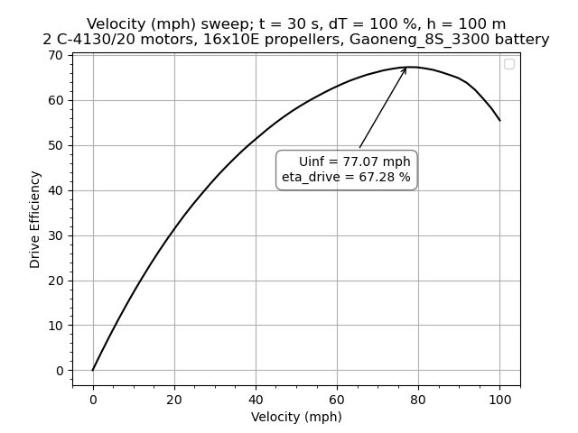
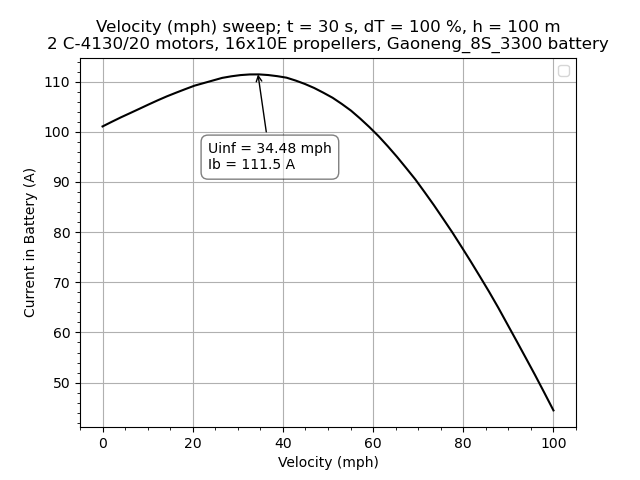
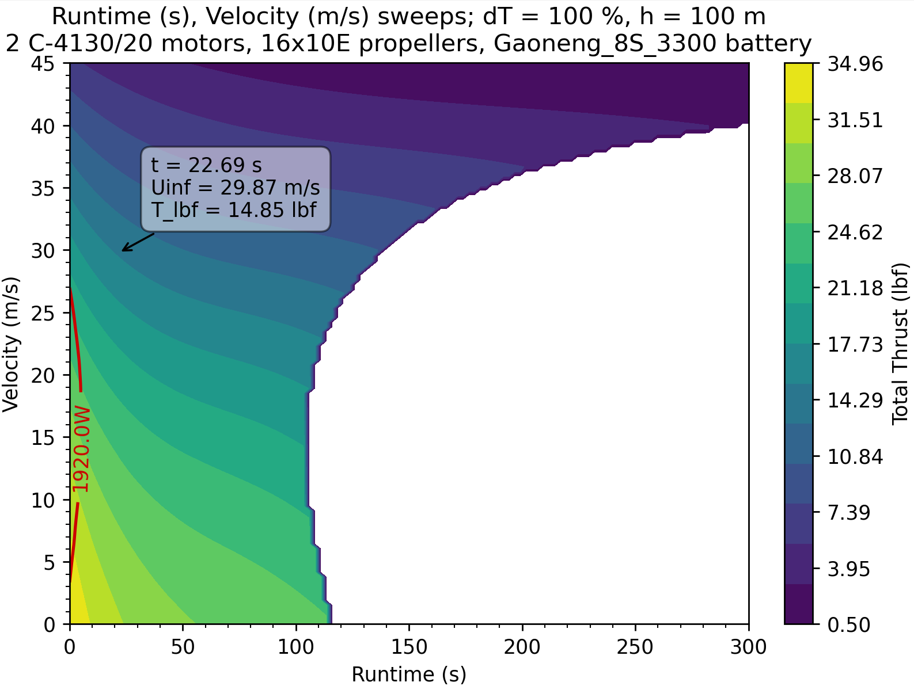
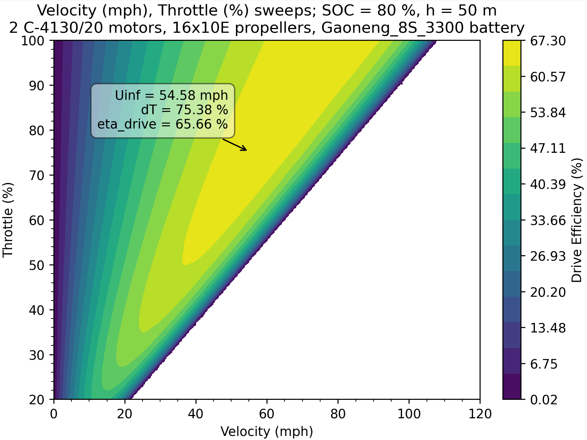
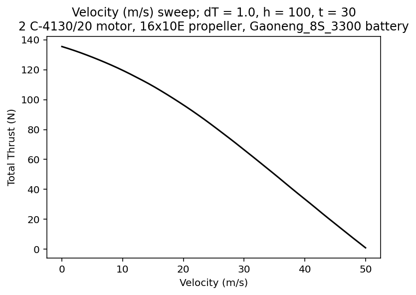
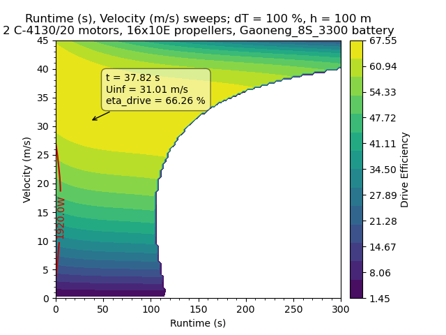
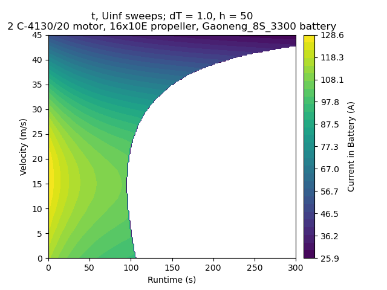
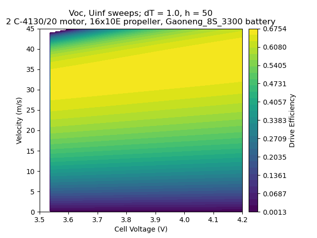
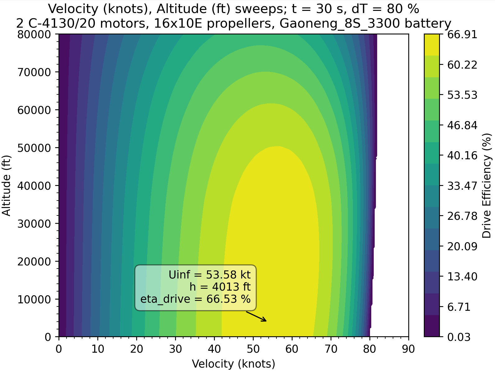

# UAV DEsign eXploration
Sammy N. Nassau, RPI DBF 2021-2026, sammynassau@gmail.com, [UAVDEX Repo](https://github.com/sammy183/UAVDEX)

UAVDEX enables rapid determination of electric aircraft propulsion quantities (i.e. thrust or efficiency) across the entire flight envelope. It is intended primarily for students competing in design competitions such as AIAA Design/Build/Fly or SAE Aero. 

The tools to thoughtfully design aircraft should be accessible to all.

<p align="center">
  <i>Example analyses using UAVDEX</i>
</p>
<p align="center">
  
  
</p>

<p align="center">
  
  
</p>

<!--
For detailed theory and validation, check out my paper published here:
**ADD LINK**
-->
# Installation
Anaconda is recommended. In anaconda prompt with a desired environment (not base) activated, simply run:
```python
pip install uavdex
```

# PointDesign
This object allows for calculation of electric aircraft propulsion with *specified components* across the entire flight envelope.

Key inputs that define a single flight condition:
* **Uinf**:    freestream velocity over the propeller
* **h**:       altitude 
   * *OR* **rho**: density 
* **dT**:      throttle setting (0-100%)
* **SOC**:     battery state of charge (0-100%)
  * *OR* **Voc**: cell voltage (~3.5-4.15 for LiPo)
  * *OR* **t**: runtime 

Runtime assumes constant current. This is valid when designing an aircraft that spends most of its flight time in a single condition (i.e. cruise).
The inputs support most common units including

| Input Type | Name in Code | Units | Input Type | Name in Code | Units |
|:------|:--------|:-------------|:-------------|:-------------|:-------------|
| Velocity | Uinf_mph | miles per hour | Throttle | dT | 0-100% | 
| Velocity | Uinf_fps | feet per second | Altitude | h_ft | feet | 
| Velocity | Uinf_mps | meters per second | Altitude | h_m | meters | 
| Velocity | Uinf_kmh | kilometers per hour | Density | rho_kgm3 | kg/m$`^3`$ |
| Velocity | Uinf_kt | knots | Density | rho_slugft3 | slug/ft$`^3`$ |
| State of Charge | SOC | 0-100% | Density | rho_lbft3 | lbm/ft$`^3`$ | 
| Battery Cell Voltage | Voc | Volts | Runtime | t_s | seconds |
| Runtime | t_m | minutes | Runtime | t_hr | hours |

Velocity, throttle, altitude/density, and state of charge/cell voltage/runtime must all be specified as shown in [PointResult Example](#pointresult).

## Component initialization
```python
import uavdex as ud

design = ud.PointDesign() 			                    # initialize PointDesign object
design.Motor('C-4130/20', nmot = 2)                     # add a motor, and specify the # of motors (nmot = 1 by default)
design.Battery('Gaoneng_8S_3300', discharge = 85)       # add a battery, and specify the maximum discharge (default is 80%)
design.Prop('16x10E')                                   # add a propeller
```
To view and edit the databases use 
```python
design.OpenMotorData()      # opens an editable csv
design.OpenBatteryData()    # opens an editable csv
design.OpenPropellerData()  # opens a folder containing .dat files from https://www.apcprop.com/technical-information/performance-data/?v=7516fd43adaa
```
Alternatively, for a list of options printed to the console:
```python
design.MotorOptions()
design.BatteryOptions()
design.PropellerOptions()
```
All values required are typically provided by the manufacturer, meaning users can add whatever components they desire.

## PointResult
A simple function to get propulsion quantities (called 'propQ' in the code) at a specified flight condition.

*PointResult example*
```python
import uavdex as ud

# Component Initialization
design = ud.PointDesign() 			   # initialize PointDesign object
design.Motor('C-4130/20', nmot = 2)    # add a motor, and specify the # of motors
design.Battery('Gaoneng_8S_3300')      # add a battery 
design.Prop('16x10E')                  # add a propeller

# PointResult
# Uinf_mps:	velocity in m/s   (alternatively use Uinf_fps, Uinf_mph, Uinf_kmh, Uinf_kt)
# dT: 	throttle (0-100%)
# h_m: 	altitude in m         (alternatively use h_ft, rho_kgm3, rho_slugft3, rho_lbft3)
# t_s: 	runtime in s          (alternatively use t_m, t_hr, SOC, Voc)
propQs = design.PointResult(Uinf_mps = 15, dT = 70, h_m = 50, t_s = 30, 
                            verbose = True) # this returns propQs as an array and also prints to console. To stop printing, set verbose = False.
```
which prints the following to the console:
> ```
> At: t = 30 s, Uinf = 15 m/s, dT = 70 %, h = 50 m
> Total Thrust (N)               = 51.281
> Total Thrust (lbf)             = 11.528
> Total Thrust (g)               = 5229.235
> Total Thrust (oz)              = 184.456
> Total Torque (N-m)             = 1.806
> Total Torque (lbf-ft)          = 1.332
> RPM                            = 6298.030
> Drive Efficiency (%)           = 54.775
> Propeller Efficiency (%)       = 64.581
> Gearing Efficiency (%)         = 100.000
> Motor Efficiency (%)           = 91.515
> ESC Efficiency (%)             = 93.000
> Battery Efficiency (%)         = 99.657
> Mech. Power Out of 1 Motor (W) = 595.549
> Elec. Power Into 1 Motor (W)   = 650.770
> Elec. Power Into 1 ESC (W)     = 699.752
> Waste Power in 1 Motor (W)     = 55.221
> Waste Power in 1 ESC (W)       = 48.983
> Waste Power in 1 Battery (W)   = 4.810
> Current in 1 Motor (A)         = 29.138
> Current in 1 ESC (A)           = 21.932
> Current in Battery (A)         = 43.864
> Voltage in 1 Motor (V)         = 22.334
> Voltage in 1 ESC (V)           = 31.905
> Battery Voltage (V)            = 31.905
> Voltage Per Cell (V)           = 4.002
> State of Charge (%)            = 88.923
> ```

propQs is an array containing the following propulsion quantities,
| Index | Symbol | Description | Units | Index | Symbol | Description | Units |
|------:|--------|-------------|-------|-------|-------|-------|-------|
| 0 | `T_N` | Total Thrust | N | 14 | `Pin_m` | Electrical Power Into 1 Motor | W |
| 1 | `T_lbf` | Total Thrust | lbf | 15 | `Pin_c` | Electrical Power Into 1 ESC | W |
| 2 | `T_g` | Total Thrust | g | 16 | `Pw_m` | Waste Power in 1 Motor | W |
| 3 | `T_oz` | Total Thrust | oz | 17 | `Pw_c` | Waste Power in 1 ESC | W |
| 4 | `Q_Nm` | Total Torque | N·m | 18 | `Pw_b` | Waste Power in 1 Battery | W |
| 5 | `Q_lbfft` | Total Torque | lbf·ft | 19 | `Im` | Current in 1 Motor | A |
| 6 | `RPM` | Propeller Speed | RPM | 20 | `Ic` | Current in 1 ESC | A |
| 7 | `eta_drive` | Drive Efficiency | % | 21 | `Ib` | Current in Battery | A |
| 8 | `eta_p` | Propeller Efficiency | % | 22 | `Vm` | Voltage in 1 Motor | V |
| 9 | `eta_g` | Gearing Efficiency | % | 23 | `Vc` | Voltage in 1 ESC | V |
| 10 | `eta_m` | Motor Efficiency | % | 24 | `Vb` | Battery Voltage | V |
| 11 | `eta_c` | ESC Efficiency | % | 25 | `Voc` | Voltage Per Cell | V |
| 12 | `eta_b` | Battery Efficiency | % | 26 | `SOC` | State of Charge | % |
| 13 | `Pout` | Mechanical Power Out of 1 Motor | W |


<!--
| Index | Symbol      | Description                                      | Units |
|------:|-------------|--------------------------------------------------|-------|
| 0     | ```'T' ```           | Thrust                                          | N     |
| 1     | ```'Q'```           | Torque                                           | N·m   |
| 2     | ```'RPM'```         | Revolutions per minute (propeller)              | RPM   |
| 3     | ```'eta_drive'```   | Propulsion drive efficiency                     | %     |
| 4     | ```'eta_g'```       | Gearbox efficiency                              | %     |
| 5     | ```'eta_m'```       | Motor efficiency                                | %     |
| 6     | ```'eta_c'```       | ESC efficiency                                  | %     |
| 7     | ```'eta_b'```       | Battery efficiency                              | %     |
| 8     | ```'Pout'```        | Shaft/mechanical power out of 1 motor           | W     |
| 9     | ```'Pin_m'```       | Electrical power into 1 motor                   | W     |
| 10    | ```'Pin_c'```       | Electrical power into 1 ESC                     | W     |
| 11    | ```'Pw_m'```        | Waste power in 1 motor                          | W     |
| 12    | ```'Pw_c'```        | Waste power in 1 ESC                            | W     |
| 13    | ```'Pw_b'```        | Waste power in 1 battery                        | W     |
| 14    | ```'Im'```          | Motor current                                   | A     |
| 15    | ```'Ic'```          | ESC current                                     | A     |
| 16    | ```'Ib'```          | Battery current                                 | A     |
| 17    | ```'Vm'```          | Motor voltage                                   | V     |
| 18    | ```'Vc'```          | ESC voltage                                     | V     |
| 19    | ```'Vb'```          | Battery voltage                                 | V     |
| 20    | ```'Voc'```         | Cell voltage                                    | V     |
| 21    | ```'SOC'```         | Battery state of charge                         | %     |
-->

## LinePlot
To plot a *sweep* of any one of the 4 inputs (Uinf, dT, h/rho, Voc/SOC/t) with the others fixed, use a LinePlot. The output variable plotted on the y-axis will be a selected propQ from the list above.

To select a propQ output, input a single variable or a list of variables as shown below
```python
propQ = 'T_lbf'                       # for a single plot
# OR
propQ = ['T_lbf', 'eta_drive', 'Ib']  # to create multiple plots of propQs for the same sweep
```

*LinePlot example*
```python
import uavdex as ud
import numpy as np

# Component Initialization
design = ud.PointDesign() 				# initialize PointDesign object
design.Motor('C-4130/20', nmot = 2)		# add a motor, and specify the # of motors
design.Battery('Gaoneng_8S_3300') 		# add a battery 
design.Prop('16x10E') 					# add a propeller

# LinePlot usage
design.LinePlot(propQ = ['T_lbf','eta_drive','Ib'], 
                Uinf_mph = np.linspace(0, 100), 
                dT = 100, h_m = 100, t_s = 30)
```
This code opens the plots below. Datatips pop up when clicking anywhere along the line in an interactive viewer (see [Python IDE notes](#notes-on-python-ide-usage)).
<table>
	<tr>
		<td width="33%" valign="top">
			<p align="center">
				<a></a>
			</p>
			
      &nbsp;&nbsp;&nbsp;&nbsp;&nbsp;&nbsp;&nbsp;&nbsp;&nbsp;&nbsp;&nbsp;&nbsp;&nbsp;&nbsp;&nbsp;&nbsp;&nbsp;&nbsp;&nbsp;&nbsp;&nbsp;&nbsp;&nbsp;&nbsp;&nbsp;&nbsp;&nbsp;&nbsp;&nbsp;&nbsp;&nbsp;&nbsp;&nbsp;&nbsp;&nbsp;&nbsp;&nbsp;&nbsp;&nbsp;&nbsp;&nbsp;&nbsp;&nbsp;&nbsp;&nbsp;&nbsp;&nbsp;&nbsp;&nbsp;&nbsp;&nbsp;&nbsp;&nbsp;&nbsp;&nbsp;&nbsp;&nbsp;&nbsp;&nbsp;&nbsp;&nbsp;&nbsp;&nbsp;&nbsp;&nbsp;&nbsp;&nbsp;&nbsp;&nbsp;&nbsp;&nbsp;&nbsp;&nbsp;&nbsp;&nbsp;&nbsp;&nbsp;&nbsp;&nbsp;&nbsp;&nbsp;&nbsp;&nbsp;&nbsp;&nbsp;&nbsp;&nbsp;&nbsp;&nbsp;&nbsp;&nbsp;&nbsp;&nbsp;&nbsp;&nbsp;&nbsp;&nbsp;&nbsp;&nbsp;&nbsp;&nbsp;&nbsp;
		</td>
		<td width="33%" valign="top">
			<p align="center">
				<a></a>
			</p>
			
&nbsp;&nbsp;&nbsp;&nbsp;&nbsp;&nbsp;&nbsp;&nbsp;&nbsp;&nbsp;&nbsp;&nbsp;&nbsp;&nbsp;&nbsp;&nbsp;&nbsp;&nbsp;&nbsp;&nbsp;&nbsp;&nbsp;&nbsp;&nbsp;&nbsp;&nbsp;&nbsp;&nbsp;&nbsp;&nbsp;&nbsp;&nbsp;&nbsp;&nbsp;&nbsp;&nbsp;&nbsp;&nbsp;&nbsp;&nbsp;&nbsp;&nbsp;&nbsp;&nbsp;&nbsp;&nbsp;&nbsp;&nbsp;&nbsp;&nbsp;&nbsp;&nbsp;&nbsp;&nbsp;&nbsp;&nbsp;&nbsp;&nbsp;&nbsp;&nbsp;&nbsp;&nbsp;&nbsp;&nbsp;&nbsp;&nbsp;&nbsp;&nbsp;&nbsp;&nbsp;&nbsp;&nbsp;&nbsp;&nbsp;&nbsp;&nbsp;&nbsp;&nbsp;&nbsp;&nbsp;&nbsp;&nbsp;&nbsp;&nbsp;&nbsp;&nbsp;&nbsp;&nbsp;&nbsp;&nbsp;&nbsp;&nbsp;&nbsp;&nbsp;&nbsp;&nbsp;&nbsp;&nbsp;&nbsp;&nbsp;&nbsp;&nbsp;
		</td>
		<td width="33%" valign="top">
			<p align="center">
				<a></a>
			</p>
			
&nbsp;&nbsp;&nbsp;&nbsp;&nbsp;&nbsp;&nbsp;&nbsp;&nbsp;&nbsp;&nbsp;&nbsp;&nbsp;&nbsp;&nbsp;&nbsp;&nbsp;&nbsp;&nbsp;&nbsp;&nbsp;&nbsp;&nbsp;&nbsp;&nbsp;&nbsp;&nbsp;&nbsp;&nbsp;&nbsp;&nbsp;&nbsp;&nbsp;&nbsp;&nbsp;&nbsp;&nbsp;&nbsp;&nbsp;&nbsp;&nbsp;&nbsp;&nbsp;&nbsp;&nbsp;&nbsp;&nbsp;&nbsp;&nbsp;&nbsp;&nbsp;&nbsp;&nbsp;&nbsp;&nbsp;&nbsp;&nbsp;&nbsp;&nbsp;&nbsp;&nbsp;&nbsp;&nbsp;&nbsp;&nbsp;&nbsp;&nbsp;&nbsp;&nbsp;&nbsp;&nbsp;&nbsp;&nbsp;&nbsp;&nbsp;&nbsp;&nbsp;&nbsp;&nbsp;&nbsp;&nbsp;&nbsp;&nbsp;&nbsp;&nbsp;&nbsp;&nbsp;&nbsp;&nbsp;&nbsp;&nbsp;&nbsp;&nbsp;&nbsp;&nbsp;&nbsp;&nbsp;&nbsp;&nbsp;&nbsp;&nbsp;&nbsp;
		</td>
	</tr>
</table>

np.linspace simply samples 50 points by default between the start and ending values. To sample 200 points and get a smoother curve, use 
```python
Uinf_mph = np.linspace(0, 100, 200)
```
Alternatively, Uinf can be set to a specific value and sweeps of another quantity (dT, h/rho, or SOC/Voc/t) used.


## ContourPlot
For sweeps of two inputs, use a contour plot!

*ContourPlot example*
```python
import uavdex as ud
import numpy as np

# Component Initialization
design = ud.PointDesign() 				# initialize PointDesign object
design.Motor('C-4130/20', nmot = 2)		# add a motor, and specify the # of motors
design.Battery('Gaoneng_8S_3300') 		# add a battery 
design.Prop('16x10E') 					# add a propeller

# to control the number of points used in linspace (n = 50 --> ~5s runtime, n = 200 --> ~15s runtime)
n = 120  

# ContourPlot (sweeps of velocity and runtime)
design.ContourPlot(propQ = ['T_lbf', 'eta_drive', 'Ib'],
                   Uinf_mps = np.linspace(0, 45, n), 
                   t_s = np.linspace(0, 300, n),
                   dT = 100, 
                   h_m = 100)
```
<!-- the following is incredibly cooked, but it gets the plots to be large and pretty -->

<table>
  <tr>
    <td align="center" valign="top">
      Thrust for velocity vs runtime<br>
      <br>
      &nbsp;&nbsp;&nbsp;&nbsp;&nbsp;&nbsp;&nbsp;&nbsp;&nbsp;&nbsp;&nbsp;&nbsp;&nbsp;&nbsp;&nbsp;&nbsp;&nbsp;&nbsp;&nbsp;&nbsp;&nbsp;&nbsp;&nbsp;&nbsp;&nbsp;&nbsp;&nbsp;&nbsp;&nbsp;&nbsp;&nbsp;&nbsp;&nbsp;&nbsp;&nbsp;&nbsp;&nbsp;&nbsp;&nbsp;&nbsp;&nbsp;&nbsp;&nbsp;&nbsp;&nbsp;&nbsp;&nbsp;&nbsp;&nbsp;&nbsp;&nbsp;&nbsp;&nbsp;&nbsp;&nbsp;&nbsp;&nbsp;&nbsp;&nbsp;&nbsp;&nbsp;&nbsp;&nbsp;&nbsp;&nbsp;&nbsp;&nbsp;&nbsp;&nbsp;&nbsp;&nbsp;&nbsp;&nbsp;&nbsp;&nbsp;&nbsp;&nbsp;&nbsp;&nbsp;&nbsp;&nbsp;&nbsp;&nbsp;&nbsp;&nbsp;&nbsp;&nbsp;&nbsp;&nbsp;&nbsp;&nbsp;&nbsp;&nbsp;&nbsp;&nbsp;&nbsp;&nbsp;&nbsp;&nbsp;&nbsp;&nbsp;&nbsp;
    </td>
    <td align="center" valign="top">
      Propulsion Efficiency for velocity vs runtime<br>
      <br>
      &nbsp;&nbsp;&nbsp;&nbsp;&nbsp;&nbsp;&nbsp;&nbsp;&nbsp;&nbsp;&nbsp;&nbsp;&nbsp;&nbsp;&nbsp;&nbsp;&nbsp;&nbsp;&nbsp;&nbsp;&nbsp;&nbsp;&nbsp;&nbsp;&nbsp;&nbsp;&nbsp;&nbsp;&nbsp;&nbsp;&nbsp;&nbsp;&nbsp;&nbsp;&nbsp;&nbsp;&nbsp;&nbsp;&nbsp;&nbsp;&nbsp;&nbsp;&nbsp;&nbsp;&nbsp;&nbsp;&nbsp;&nbsp;&nbsp;&nbsp;&nbsp;&nbsp;&nbsp;&nbsp;&nbsp;&nbsp;&nbsp;&nbsp;&nbsp;&nbsp;&nbsp;&nbsp;&nbsp;&nbsp;&nbsp;&nbsp;&nbsp;&nbsp;&nbsp;&nbsp;&nbsp;&nbsp;&nbsp;&nbsp;&nbsp;&nbsp;&nbsp;&nbsp;&nbsp;&nbsp;&nbsp;&nbsp;&nbsp;&nbsp;&nbsp;&nbsp;&nbsp;&nbsp;&nbsp;&nbsp;&nbsp;&nbsp;&nbsp;&nbsp;&nbsp;&nbsp;&nbsp;&nbsp;&nbsp;&nbsp;&nbsp;&nbsp;
    </td>
    <td align="center" valign="top">
      Battery Current for velocity vs runtime<br>
      <br>
      &nbsp;&nbsp;&nbsp;&nbsp;&nbsp;&nbsp;&nbsp;&nbsp;&nbsp;&nbsp;&nbsp;&nbsp;&nbsp;&nbsp;&nbsp;&nbsp;&nbsp;&nbsp;&nbsp;&nbsp;&nbsp;&nbsp;&nbsp;&nbsp;&nbsp;&nbsp;&nbsp;&nbsp;&nbsp;&nbsp;&nbsp;&nbsp;&nbsp;&nbsp;&nbsp;&nbsp;&nbsp;&nbsp;&nbsp;&nbsp;&nbsp;&nbsp;&nbsp;&nbsp;&nbsp;&nbsp;&nbsp;&nbsp;&nbsp;&nbsp;&nbsp;&nbsp;&nbsp;&nbsp;&nbsp;&nbsp;&nbsp;&nbsp;&nbsp;&nbsp;&nbsp;&nbsp;&nbsp;&nbsp;&nbsp;&nbsp;&nbsp;&nbsp;&nbsp;&nbsp;&nbsp;&nbsp;&nbsp;&nbsp;&nbsp;&nbsp;&nbsp;&nbsp;&nbsp;&nbsp;&nbsp;&nbsp;&nbsp;&nbsp;&nbsp;&nbsp;&nbsp;&nbsp;&nbsp;&nbsp;&nbsp;&nbsp;&nbsp;&nbsp;&nbsp;&nbsp;&nbsp;&nbsp;&nbsp;&nbsp;&nbsp;&nbsp;
    </td>
  </tr>
</table>
At some constant velocity, the right side bound of the contour plot indicates the runtime of the propulsion system in seconds. This is determined by where SOC = (100 - discharge). Additional bounds can originate when the propulsion system cannot generate thrust at some combination of Uinf, dT, Voc, and h. 
                                          
### Additional ContourPlot examples
<table>
	<tr>
		<td width="33%" valign="top">
			<p align="center">
				<a>Efficiency for velocity vs throttle
          <pre>design.ContourPlot(propQ = 'eta_drive',
                  Uinf_mph = np.linspace(0, 120, 200), 
                  dT = np.linspace(20, 100, 200), 
                  h_m = 50, 
                  t_s = 20)</pre>
        </a>
			</p>
			
		</td>
		<td width="33%" valign="top">
			<p align="center">
				<a>Efficiency for velocity vs cell voltage
          <pre>design.ContourPlot(propQ = 'eta_drive',
                  Uinf_mps = np.linspace(0, 45, 200), 
                  dT = 100,
                  h_m = 50, 
                  Voc = np.linspace(3.5, 4.2, 200))</pre>
        </a>
			</p>
      
		</td>
		<td width="33%" valign="top">
			<p align="center">
				<a>Efficiency for velocity vs altitude
           <pre>design.ContourPlot(propQ = 'eta_drive',
                  Uinf_kt = np.linspace(0, 90, n),
                  dT = 80,
                  h_ft = np.linspace(0, 80000, n),
                  t_s = 30)</pre>
        </a>
			</p>
			
		</td>
	</tr>
</table>
The bounds on these plots occur when the throttle setting and battery voltage are low, meaning the propulsion drive cannot produce thrust at the given velocity. Therefore, efficiency goes to zero.

### Notes on Python IDE usage
- *VSCode*:     The best IDE for viewing UAVDEX plots and using the built-in datatips. No changes necessary.
- *PyCharm*:    "Settings > Tools > Python Plots > Show plots in tool window" should be unchecked for interactive datatips.
- *Spyder*:     Switch plot renderer from inline to QT. If the computer has a 4k screen, the text will be extremely small unless "Tools > Preferences > Application > Interface > Enable Auto High DPI Scaling" is selected. 
- *Jupyter*:    Displays static plots but it cannot support interactive datatips at this time.

## Future updates
1. Automatic boundary selection (no input array needed, just specify which variable is the sweep)
2. Battery resistance near low SOC modeled
3. Manual limit lines based on component values (i.e. ESC waste power < 500 W)
4. Expansion of database features
5. Functions for the best Uinf, dT, h for maximum efficiency

Have any requests? Submit a ticket on the google form below or open a github issue thread.
#### TODO: GOOGLE FORM

Want a propulsion component added to the default package CSV sheets? Request here:
#### TODO: GOOGLE FORM


<!--
### Primary Objects:

#### PointDesign
PointDesign is the primary method for electric


#### DesignStudy
#### ClassicalSizing

# Propulsion Models 
--> 

[1]: https://rincon-mora.gatech.edu/publicat/jrnls/tec05_batt_mdl.pdf
[2]: https://www.researchgate.net/profile/Andrew-Gong-2/publication/326263042_Performance_Testing_and_Modeling_of_a_Brushless_DC_Motor_Electronic_Speed_Controller_and_Propeller_for_a_Small_UAV_Application/links/5b52a5c545851507a7b6f581/Performance-Testing-and-Modeling-of-a-Brushless-DC-Motor-Electronic-Speed-Controller-and-Propeller-for-a-Small-UAV-Application.pdf
[3]: https://web.mit.edu/drela/Public/web/qprop/motor1_theory.pdf
[4]: https://www.mdpi.com/2226-4310/11/1/16


